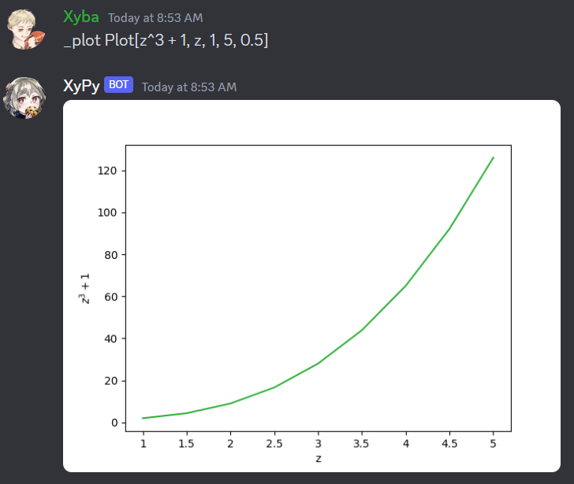

# XyPy
   

## Background
- Purpose: Personal project to learn how to code Discord bots, hosted in [replit](https://replit.com/@XybaFenix/XyPy)
- Involvement: Individual
- Tech Stack: Python, Flask, sympy

## Notes
- Planned for Improvement: No
    - This project will likely be completely overhauled
    - Planned improvements will be on new bot
- Previously last updated on 8 April 2021