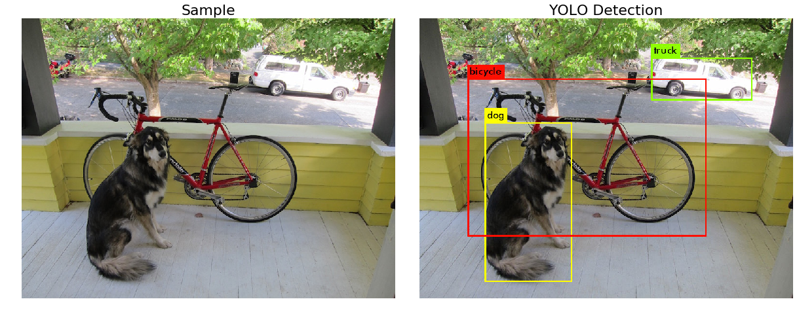

# YOLO v3 Inference with Pre-Trained Weights
   

## Background
- Purpose: Homework project for Research Methods (SCMA603901) course taken on Year 3 Term 1*
- Involvement: Individual
- Tech Stack: Python, OpenCV

## Notes
- Planned for Improvement: Maybe
- (*) Relates to TBA